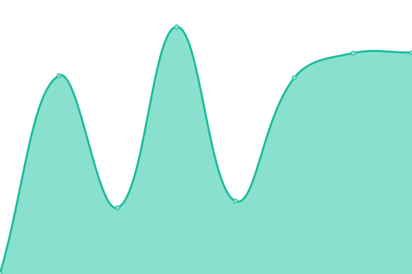

# [📈 Live Status](https://ianmyles.github.io/uptime): <!--live status--> **🟩 All systems operational**

This repository contains the open-source uptime monitor and status page for [ianmyles](https://ianmyles.github.io/uptime), powered by [Upptime](https://github.com/upptime/upptime).

With [Upptime](https://upptime.js.org), you can get your own unlimited and free uptime monitor and status page, powered entirely by a GitHub repository. We use [Issues](https://github.com/ianmyles/uptime/issues) as incident reports, [Actions](https://github.com/ianmyles/uptime/actions) as uptime monitors, and [Pages](https://ianmyles.github.io/uptime) for the status page.

<!--start: status pages-->
<!-- This summary is generated by Upptime (https://github.com/upptime/upptime) -->
<!-- Do not edit this manually, your changes will be overwritten -->
<!-- prettier-ignore -->
| URL | Status | History | Response Time | Uptime |
| --- | ------ | ------- | ------------- | ------ |
|  [Ian Myles](https://www.ianmyles.com) | 🟩 Up | [ian-myles.yml](https://github.com/ianmyles/uptime/commits/master/history/ian-myles.yml) | 

 293ms
     
 | 

<a href="https://ianmyles.github.io/uptime/history/ian-myles">100.00%</a>
    

|  [Cairde](https://www.cairde.ie) | 🟩 Up | [cairde.yml](https://github.com/ianmyles/uptime/commits/master/history/cairde.yml) | 

 2655ms
     
 | 

<a href="https://ianmyles.github.io/uptime/history/cairde">100.00%</a>
    

|  [HealthConnect](https://healthconnect.ie/) | 🟩 Up | [health-connect.yml](https://github.com/ianmyles/uptime/commits/master/history/health-connect.yml) | 

 1132ms
     
 | 

<a href="https://ianmyles.github.io/uptime/history/health-connect">100.00%</a>
    

|  [Google](https://www.google.com) | 🟩 Up | [google.yml](https://github.com/ianmyles/uptime/commits/master/history/google.yml) | 

 102ms
     
 | 

<a href="https://ianmyles.github.io/uptime/history/google">100.00%</a>
    

|  [Wikipedia](https://en.wikipedia.org) | 🟩 Up | [wikipedia.yml](https://github.com/ianmyles/uptime/commits/master/history/wikipedia.yml) | 

 321ms
     
 | 

<a href="https://ianmyles.github.io/uptime/history/wikipedia">100.00%</a>
    

|  [Hacker News](https://news.ycombinator.com) | 🟩 Up | [hacker-news.yml](https://github.com/ianmyles/uptime/commits/master/history/hacker-news.yml) | 

 390ms
     
 | 

<a href="https://ianmyles.github.io/uptime/history/hacker-news">100.00%</a>
    

<!--end: status pages-->

[**Visit our status website →**](https://ianmyles.github.io/uptime)

## 📄 License

- Powered by: [Upptime](https://github.com/upptime/upptime)
- Code: [MIT](./LICENSE) © [ianmyles](https://ianmyles.github.io/uptime)
- Data in the `./history` directory: [Open Database License](https://opendatacommons.org/licenses/odbl/1-0/)
